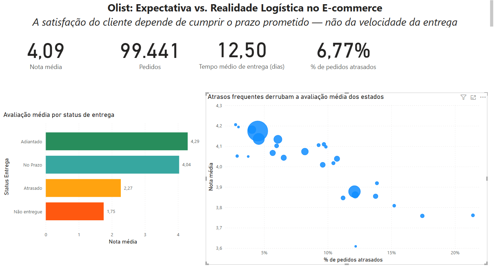
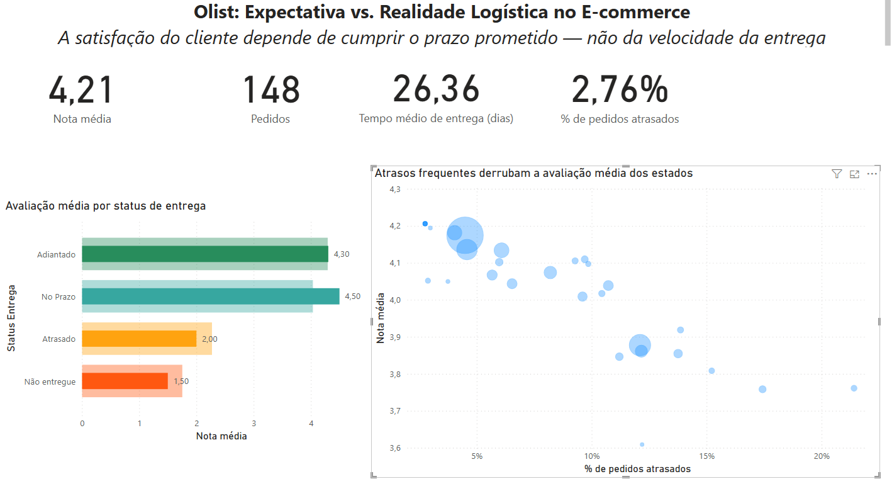
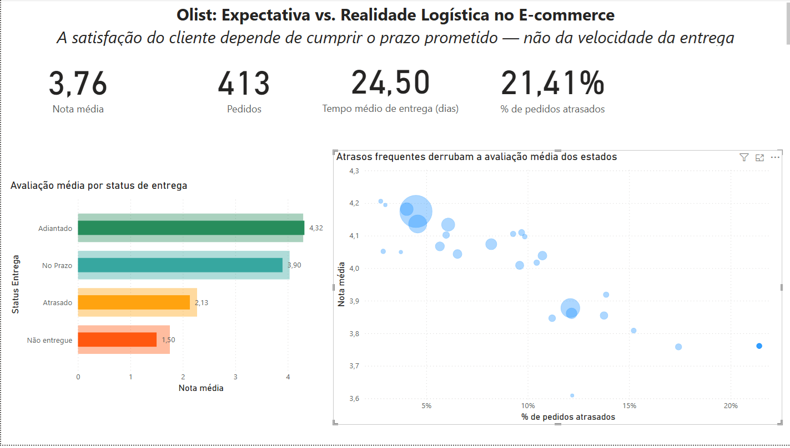

# Olist: Expectativa vs. Realidade Logística no E-commerce

Uma análise baseada no dataset Olist (Kaggle) investigando o que realmente
impacta a satisfação do cliente no e-commerce: a velocidade da entrega ou o
cumprimento do prazo prometido.

O projeto tem duas fases. Na primeira, a investigação foi conduzida em SQL e
Python (pandas) sobre a base relacional. Na segunda, os achados foram
reconstruídos e refinados em um dashboard interativo de Power BI, que expôs
nuances que a análise inicial não capturava.

---

## A Pergunta de Negócio

Com 11 mil pedidos recebendo a avaliação mínima (nota 1), o que irrita mais o
cliente: a lentidão absoluta da entrega, ou a quebra da expectativa do prazo
que lhe foi prometido?

## A Descoberta

Classificando cada pedido pela comparação entre a data de entrega real e a data
estimada, o impacto do atraso se mostrou brutal:

- **92%** dos pedidos chegam adiantados, com nota média de **4,29**.
- **8%** sofrem atraso, e a nota média despenca para **2,57** — uma queda de
  40,1% na avaliação.

### Refinamento na Fase 2 (Power BI)

A reconstrução em Power BI permitiu separar uma terceira categoria que a análise
inicial agregava ao atraso: os pedidos entregues **exatamente no prazo**
(diferença de zero dias entre estimado e real). Com essa distinção, o quadro
fica mais nítido:

| Situação da entrega | Nota média |
|---------------------|-----------|
| Adiantada           | 4,29      |
| No prazo            | 4,04      |
| Atrasada            | 2,27      |
| Não entregue        | 1,75      |

A leitura muda a conclusão de lugar. Chegar **adiantado** (4,29) ou **no prazo**
(4,04) produz notas quase idênticas — uma diferença de apenas 0,25. Já o salto
de "no prazo" para "atrasado" derruba a nota em 1,77 ponto. Ou seja: antecipar a
entrega quase não move a satisfação; **cumprir o prazo já basta, e descumpri-lo
é o que destrói a avaliação.** O valor de 2,57 da fase inicial era, na prática,
uma média que misturava os pedidos no prazo (nota alta) com os atrasados (nota
baixa).

## A Tese

A satisfação no e-commerce é gestão de expectativa, não velocidade.

A prova mais forte vem de comparar estados com **velocidade de entrega
semelhante mas taxas de atraso opostas**. Se a velocidade fosse o fator
determinante, estados igualmente lentos teriam notas parecidas — mas não é o que
acontece:

| Estado | Pedidos | Entrega média (dias) | % atraso | Nota média |
|--------|--------:|---------------------:|---------:|-----------:|
| AM     | 148     | 26,4                 | 2,8%     | 4,21       |
| AP     | 68      | 27,2                 | 3,0%     | 4,19       |
| AL     | 413     | 24,5                 | 21,4%    | 3,76       |
| RJ     | 12.852  | ~15,2                | 12,2%    | 3,88       |

Amazonas e Amapá são os estados mais lentos do país (26–27 dias), mas entregam
com pontualidade altíssima (menos de 3% de atraso) — e têm as melhores notas.
Alagoas entrega em tempo semelhante (24,5 dias), mas atrasa **um em cada cinco**
pedidos, e sua nota desaba para 3,76. Mesma lentidão, resultados opostos; a
única variável que difere é o cumprimento da promessa.

O Rio de Janeiro reforça o ponto no outro extremo: é o segundo maior mercado, com
entrega rápida (~15 dias), mas uma taxa de atraso de 12% o coloca entre os piores
em satisfação. O problema de nota da Olist não está na distância — está na
promessa mal calibrada.

**Recomendação de negócio:** o foco não deve ser apenas entregar mais rápido, e
sim ajustar o prazo prometido à capacidade real de cada rota e cumpri-lo. Para um
estado como o RJ, recalibrar a promessa custa zero em logística e recuperaria
avaliação.

*Nota sobre amostragem: AM (148) e AP (68) têm volumes modestos, então suas notas
por subcategoria são mais voláteis; a leitura robusta vem dos agregados por
estado, não das quebras internas. AL (413) e RJ (12.852) são mais estáveis. O
tamanho das bolhas no gráfico de dispersão comunica essa diferença de volume.*

## O Dashboard

**Visão geral**

**Amazonas — lento, pontual, bem avaliado**

**Alagoas — lento, com muitos atrasos, mal avaliado**

O dashboard é interativo: clicar em uma categoria de entrega ou em um estado
recalcula todos os indicadores para aquele recorte. O arquivo `.pbix` está no
repositório para quem quiser explorar.

## Qualidade de Dados

A auditoria da base, conduzida nas duas fases, revelou três inconsistências que
foram tratadas ou documentadas:

1. **547 pedidos com avaliações duplicadas**, decorrentes de entregas
   fracionadas. Na fase SQL, foram consolidados pela CTE `reviews_unicas`, que
   calcula a média aritmética das notas por pedido antes dos cruzamentos. Na fase
   BI, a mesma consolidação foi reproduzida via agrupamento no Power Query, e o
   número foi confirmado de forma independente: 543 pedidos com 2 avaliações e 4
   com 3, totalizando 551 linhas excedentes.

2. **8 pedidos com status `delivered` mas sem data de entrega registrada.** Sete
   deles possuíam registro de saída para a transportadora, indicando falha na
   baixa final do sistema — não pedidos inexistentes.

3. **6 pedidos com status diferente de `delivered` mas com data de entrega
   preenchida** — provável entrega seguida de mudança de status não sincronizada.

A consolidação por pedido (em vez de por avaliação) é uma decisão deliberada de
grão: a unidade de análise da tese é o pedido, então um pedido fracionado não
deve pesar mais de uma vez na satisfação média.

## Ferramentas

- **SQL** (SQLite) e **Python** (pandas) — investigação inicial, no Google Colab.
- **Power BI** — modelagem em esquema estrela, medidas em DAX e dashboard
  interativo. O modelo usa 8 das 9 tabelas do dataset (a de geolocalização foi
  descartada por não ser necessária à análise).

## Estrutura do Repositório

- `Projeto_Análise de dados.ipynb` — notebook da fase SQL/pandas.
- `olist_dashboard.pbix` — arquivo do dashboard Power BI.
- `imagens/` — capturas do dashboard.
